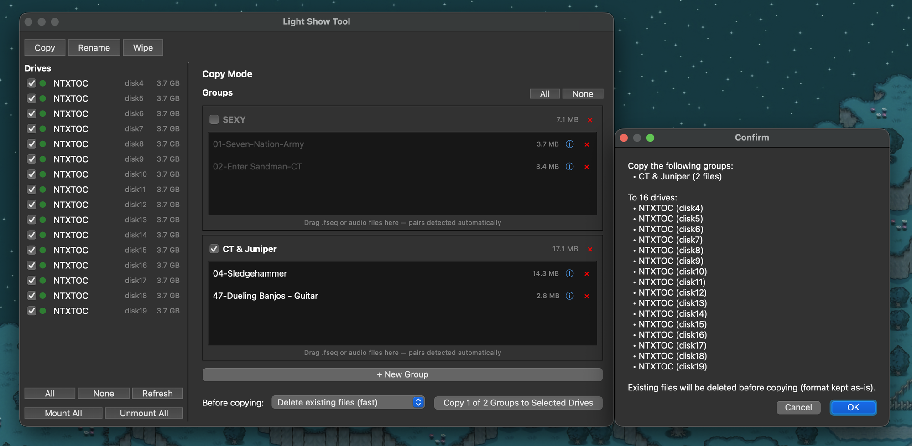

# Light Show Tool

A macOS desktop app for managing light show files across multiple USB thumb drives simultaneously. Supports copying, renaming, and wiping drives in bulk.



## Requirements

- macOS (uses `diskutil` for drive management)
- Python 3.10+

## Install

```bash
git clone https://github.com/thedeo/light-show-tool.git
cd light-show-tool
make install
```

This creates a local virtual environment (`.venv`) and installs dependencies into it.

## Run

```bash
make run
```

## Drives

The drive list shows every connected external drive with a live mounted/unmounted status dot, and flags any drive whose filesystem isn't Tesla-compatible (FAT32/exFAT) with a warning icon and tooltip. Unmounted drives can't be selected for an operation until they're mounted.

- **All / None** — select or deselect every mounted drive
- **Refresh** — rescan connected drives
- **Mount All / Unmount All** — bulk mount or unmount every drive in one action (unmounting asks for confirmation first)

Drive scanning runs in the background, so the app stays responsive even if `diskutil` is slow to respond.

## Modes

### Copy
Drag `.fseq` or audio (`.mp3` / `.wav`) files into a group — the app automatically detects and pairs the matching file by name. Multiple groups can be created and selectively included or excluded per copy operation.

Before copying, choose how to handle each drive's existing contents:
- **Don't erase** — copy on top of whatever's already there
- **Delete existing files (fast)** — clear the drive's contents (keeping its current format) before copying; much faster than a full reformat
- **Format drive (slow, full reformat)** — erase and reformat as FAT32 before copying; required for drives flagged as not Tesla-compatible

Progress is shown both per-drive (current file/bytes) and as an overall percentage across all selected drives.

### Rename
Rename all selected drives to the same FAT32 label (max 11 characters).

### Wipe
Erase and reformat selected drives as FAT32. Requires an explicit confirmation checkbox before proceeding.

## Safety

Wipe and "delete existing files" are destructive, so the app guards against ever touching the wrong disk:

- The drive list only ever includes external, non-boot disks — even if your Mac boots from an external drive, that disk is detected and excluded automatically
- `wipe_drive` and the file-delete path both independently refuse to run against the startup disk or an empty/root mount path, regardless of how a drive entry was produced
- Every destructive action (Wipe, erase-before-copy, Unmount All) shows a confirmation dialog listing every targeted drive by name before proceeding; Wipe additionally requires checking "I understand this is permanent"

## Troubleshooting

Every run writes a fresh `light_show_tool.log` in the project folder (overwritten each launch, so it only ever holds the latest run). It records every `diskutil` call, drive scan, and copy/erase operation, including full error details when something fails — check it first if a drive errors out.

## File Pairing

Light show sequences consist of a `.fseq` file and an audio file with the same base name:

```
01-Seven-Nation-Army.fseq
01-Seven-Nation-Army.mp3
```

Drop either file and the app will locate the other automatically. If the paired file is missing or misnamed, you'll see an error with details.

## Notes

- Drive detection is fully dynamic — no disk identifiers are hardcoded
- FAT32 labels are uppercased automatically by `diskutil`
- The app requires permission to run `diskutil` commands (standard on macOS for the logged-in user)
- All `diskutil` calls are timeout-bounded and run off the main thread, so a slow or unresponsive drive can't freeze the app
- macOS-managed metadata folders (`.Spotlight-V100`, `.fseventsd`, `.Trashes`, etc.) are left alone when clearing a drive's contents, since they're permission-protected and recreated automatically
